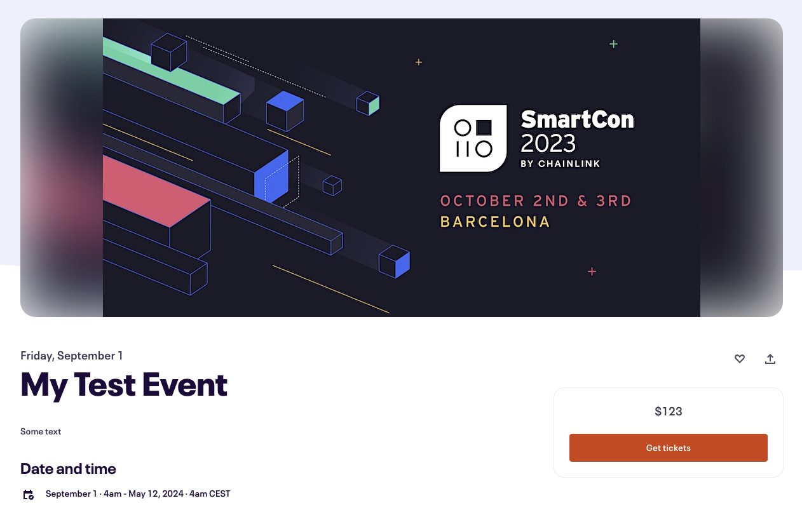

# Functions Lens Eventbrite

This project combines [Chainlink Functions](https://docs.chain.link/chainlink-functions) with [Lens Publication Actions](https://docs.lens.xyz/v2/docs/publication-actions-aka-open-actions) to demonstrate how one can generate discount codes for events on Eventbrite using Collect module.

## Prerequisites

- [Git](https://git-scm.com/book/en/v2/Getting-Started-Installing-Git)
- [Current LTS Node.js version](https://nodejs.org/en/about/releases/)
- [Foundry](https://book.getfoundry.sh/getting-started/installation)

## Getting Started

1. Install packages

```
npm install
```

2. Compile contracts

```
forge build
```

## What are we building?

Using Chainlink Functions and Lens Publication Actions, we are going to develop a system for generating discount codes for events (like Smartcon or Raave for example) hosted on Eventbrite.

The event organizer will need to create a new event on Eventbrite, following [these instructions](https://www.eventbrite.com/help/en-us/articles/551351/how-to-create-an-event).



To develop and use this project, you will need to obtain a [free Eventbrite API key](https://www.eventbrite.com/help/en-us/articles/849962/generate-an-api-key/).

Once you generate an Eventbrite API key, you can visit the following web page to validate it works as expected `https://www.eventbriteapi.com/v3/users/me/?token=<YOUR_API_KEY_GOES_HERE>`

Next, you will need to get your

- **Organization ID**, by visiting `https://www.eventbriteapi.com/v3/users/me/organizations/?token=<YOUR_API_KEY_GOES_HERE>`
- **Event ID**, by visiting `https://www.eventbriteapi.com/v3/organizations/<ORGANIZATION_ID_GOES_HERE>/events/?token=<YOUR_API_KEY_GOES_HERE>`

The core logic is stored in the [`DiscountPublicationAction.sol`](./src/DiscountPublicationAction.sol) smart contract which implements `IPublicationActionModule` and `FunctionsClient` interfaces. On Lens collect, it will make a Chainlink Functions request to execute the JavaScript code from the [`source.js`](./source.js) file, which will resolve User's address to a Lens handle and generate the Eventbrite discount code for the provided event. The [`DiscountPublicationAction.sol`](./src/DiscountPublicationAction.sol) smart contract will then store the returned discount code.


## Usage

For setting up environment variables we are going to use the [`@chainlink/env-enc`](https://www.npmjs.com/package/@chainlink/env-enc) package for extra security. It encrypts sensitive data instead of storing them as plain text in the `.env` file, by creating a new, `.env.enc` file. Although it's not recommended to push this file online, if that accidentally happens your secrets will still be encrypted.

1. Set a password for encrypting and decrypting the environment variable file. You can change it later by typing the same command.

```shell
npx env-enc set-pw
```

2. Now set the API_KEY environment variable by typing:

```shell
npx env-enc set
```

After you are done, the `.env.enc` file will be automatically generated.

If you want to validate your inputs you can always run the following command:

```shell
npx env-enc view
```

3. Run local simulation

```
forge test -vvv --ffi
```


## Disclaimer

This tutorial offers educational examples of how to use a Chainlink system, product, or service and is provided to demonstrate how to interact with Chainlink’s systems, products, and services to integrate them into your own. This template is provided “AS IS” and “AS AVAILABLE” without warranties of any kind, it has not been audited, and it may be missing key checks or error handling to make the usage of the system, product, or service more clear. Do not use the code in this example in a production environment without completing your own audits and application of best practices. Neither Chainlink Labs, the Chainlink Foundation, nor Chainlink node operators are responsible for unintended outputs that are generated due to errors in code. 
